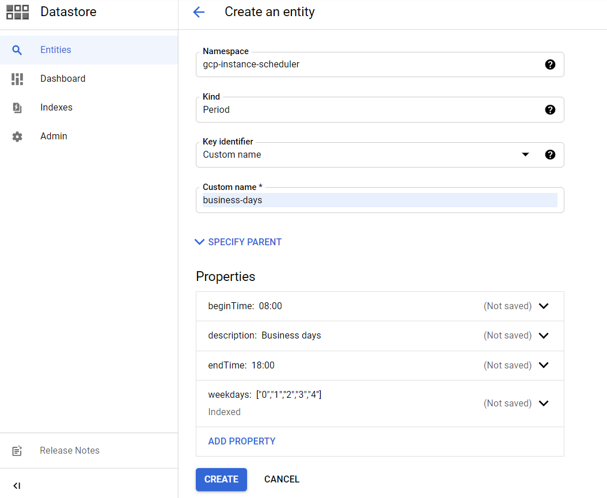
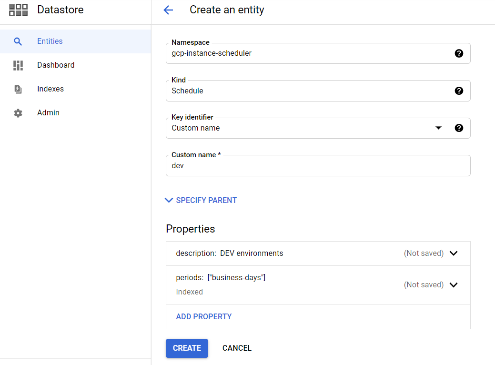

# GCP Instance Scheduler
Automatic startup and shutdown of compute instances in Google Cloud Platform. Define and manage in one place schedules for VMs in multiple projects and reduce cost of your CGP cloud.

## Components

Solution's architecture is similar to described in th article: [Scheduling compute instances with Cloud Scheduler](https://cloud.google.com/scheduler/docs/start-and-stop-compute-engine-instances-on-a-schedule/)

| Component                | Service         | Description                                  |
| ------------------------ | --------------- | -------------------------------------------- |
| configuration            | Datastore       | Scheduler configuration                      |
| instance-scheduler       | Cloud Functions | Function starting/stopping Compute Instances |
| instance-scheduler-topic | Pub/Sub Topic   | Topic for events triggering function         |
| instance-scheduler-job   | Cloud Scheduler | Cron job for function triggering             |

## Getting started

### Prerequisites

1. Install [gcloud](https://cloud.google.com/sdk)
1. Create a GCP project, set up billing
1. Enable required APIs using [this link](https://console.cloud.google.com/flows/enableapi?apiid=cloudbuild.googleapis.com,datastore.googleapis.com,cloudfunctions.googleapis.com,pubsub.googleapis.com,cloudscheduler.googleapis.com) or manually:
> 1. [Cloud Build API](https://console.cloud.google.com/apis/library/cloudbuild.googleapis.com)
> 1. [Cloud Datastore API](https://console.cloud.google.com/apis/library/datastore.googleapis.com)
> 1. [Cloud Functions API](https://console.cloud.google.com/apis/library/cloudfunctions.googleapis.com)
> 1. [Cloud Pub/Sub API](https://console.cloud.google.com/apis/library/pubsub.googleapis.com)
> 1. [Cloud Scheduler API](https://console.cloud.google.com/apis/library/cloudscheduler.googleapis.com)

### Installation
Instalation is similat to presented in [Google Cloud tutorial](https://cloud.google.com/scheduler/docs/start-and-stop-compute-engine-instances-on-a-schedule/).

1. Prepare environment
```sh
export GCP_PROJECT="Project id where scheduler will be installed"
export GCP_REGION="Region where scheduler will be installed"
export ENV_PROJECTS_LIST="You have to enable scheduling for every project separately. Set comma separated projects list with scheduling enabled e.g. project1,project2,project3"
export ENV_TIMEZONE="Scheduler timezone e.g. Europe/Warsaw"
```
2. Create role for scheduler
```sh
gcloud iam roles create InstanceSchedulerRole \
    --description "Instance Scheduler for automatic start/stop of instances" \
    --permissions compute.instances.list,compute.instances.start,compute.instances.stop \
    --stage GA --project $GCP_PROJECT
```
3. Create service account for function
```sh
gcloud iam service-accounts create instance-scheduler \
    --description="Instance scheduler" \
    --display-name="instance-scheduler"
```
4. Assign roles to service account
```sh
gcloud projects add-iam-policy-binding $GCP_PROJECT \
    --member="serviceAccount:instance-scheduler@$GCP_PROJECT.iam.gserviceaccount.com" \
    --role="projects/$GCP_PROJECT/roles/InstanceSchedulerRole"
gcloud projects add-iam-policy-binding $GCP_PROJECT \
    --member="serviceAccount:instance-scheduler@$GCP_PROJECT.iam.gserviceaccount.com" \
    --role="roles/datastore.viewer"
```
5. Create Pub/Sub topic for function triggering
```sh
gcloud pubsub topics create instance-scheduler-topic
```
6. Clone this project and and open function folder:
```sh
git clone git@github.com:lmaczulajtys/gcp-instance-scheduler.git
cd gcp-instance-scheduler/functions/instance_scheduler
```
7. Create function with pub/sub trigger
```sh
gcloud functions deploy instance-scheduler \
    --trigger-topic=instance-scheduler-topic \
    --region=$GCP_REGION \
    --runtime=python38 \
    --entry-point=main \
    --service-account=instance-scheduler@$GCP_PROJECT.iam.gserviceaccount.com \
    --set-env-vars=^:^ENV_PROJECTS_LIST=$ENV_PROJECTS_LIST:ENV_TIMEZONE=$ENV_TIMEZONE \
    --max-instances=1
``` 
8. Create Cloud Scheduler Job
```sh
gcloud scheduler jobs create pubsub instance-scheduler-job --schedule="*/5 * * * *" --topic=instance-scheduler-topic --message-body=run
```
### Configuration

#### Configuring schedules
Currently, you have to create configuration manually. CLI is planned.

Scheduling configuration is stored in Datastore in `gcp-instance-scheduler` namespace in two entity types:
* Period - information when instance should be started or stopped
> * name - period unique name
> * description - period description
> * beginTime - instance start time hour e.g. 00:00, 08:30, 18:45
> * endTime - instance stop time hour e.g. 00:00, 08:30, 18:45
> * weekdays - integer array od week days numbers (monday - 0, sunday - 6) where period is active
* Schedule - schedule with one or multiple periods. Instances are assigned to schedules - not periods.
> * name - schedule unique name
> * description - schedule description
> * periods - string array od periods in schedule

**To create Period**

1. Create entity
2. Set napespace to `gcp-instance-scheduler`
3. Set Kind to `Period`
4. Set Key identifier to `Custom name`
5. Set another values. Be careful with weekdays!!! Use example below for whole week:
```json
{
  "values": [
    {
      "integerValue": "0"
    },
    {
      "integerValue": "1"
    },
    {
      "integerValue": "2"
    },
    {
      "integerValue": "3"
    },
    {
      "integerValue": "4"
    },
    {
      "integerValue": "5"
    },
    {
      "integerValue": "6"
    }
  ]
}
```
6. See example below.


**To create Schedule**

1. Create entity
2. Set napespace to `gcp-instance-scheduler`
3. Set Kind to `Schedule`
4. Set Key identifier to `Custom name`
5. Set another values. Be careful with schedules!!! Use example below:
```json
{
  "values": [
    {
      "stringValue": "business-days"
    }
  ]
}
```
6. See example below.


#### Setting schedule on instance
To assign instance to configured schedule, you only have to add label `schedule` to your instance with schedule name as a value. For example: `schedule=business-days` or `schedule=dev`.

To disable scheduling, remove label `schedule` from your instance.

### Enabling scheduling in another project
You have to enable scheduling in every project separately.

1. Setup
```sh
export SCHEDULER_PROJECT="project id with scheduling function"
export NEW_PROJECT="project id where you want to enable scheduling"
```
2. Create role for scheduler in project and assign it to service account from scheduler project.
```sh
gcloud iam roles create InstanceSchedulerRole \
    --description "Instance Scheduler for automatic start/stop of instances" \
    --permissions compute.instances.list,compute.instances.start,compute.instances.stop \
    --stage GA --project $NEW_PROJECT
gcloud projects add-iam-policy-binding $GCP_PROJECT \
    --member="serviceAccount:instance-scheduler@$SCHEDULER_PROJECT.iam.gserviceaccount.com" \
    --role="projects/$NEW_PROJECT/roles/InstanceSchedulerRole"
```
3. Edit instance-scheduler function and extend `PROJECTS_LIST` environment variable. Add comma and new project id e.g. project1,project2,new-project
4. Click next and deploy function.

## License

This project is licensed under the Apache 2.0 License - see the [LICENSE](LICENSE) file for details.

## Acknowledgments

Main inspiration: [awslabs/aws-instance-scheduler](https://github.com/awslabs/aws-instance-scheduler)
